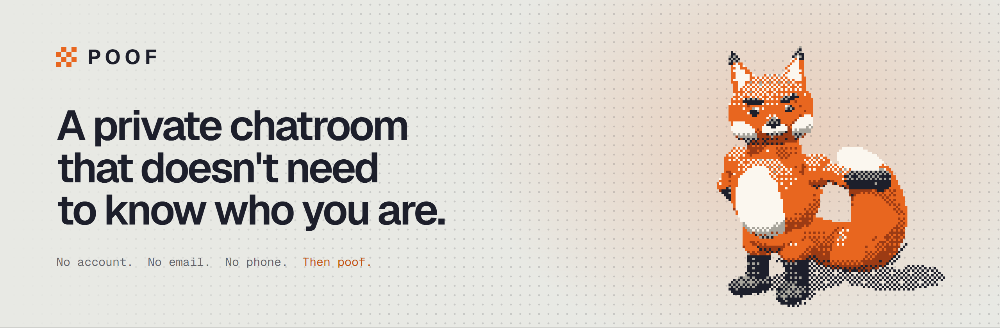

<picture>
  <source media="(prefers-color-scheme: dark)" srcset="assets/banner-dark.png">
  
</picture>

### Private by default. Temporary by design.

Create a room. Share the link. Talk privately. **Then poof.** It's gone.

No email. No phone number. No username. No password. No profile. No account waiting for you when you come back.
**A room is enough.**

#### What Poof is built on

- **End-to-end encryption.** Messages are encrypted between participants, not treated as readable server-side content.
- **Post-quantum cryptography.** Designed for a future where data intercepted today could be decrypted tomorrow.
- **Zero-knowledge principles.** The service is designed to know as little as possible about its users and their conversations.
- **Ephemeral by design.** Rooms have defined lifetimes. A Classic Room lasts 10 minutes, then it's gone.

#### The philosophy

Collect less. Expose less. Keep less. Delete what doesn't need to exist.

Privacy isn't hiding. Privacy is choosing what remains yours.

 

<picture>
  <source media="(prefers-color-scheme: dark)" srcset="assets/footer-dark.png">
  
</picture>

<a href="https://usepoof.chat">usepoof.chat</a> &nbsp;·&nbsp; <a href="https://x.com/usepoofchat">@usepoofchat</a>

